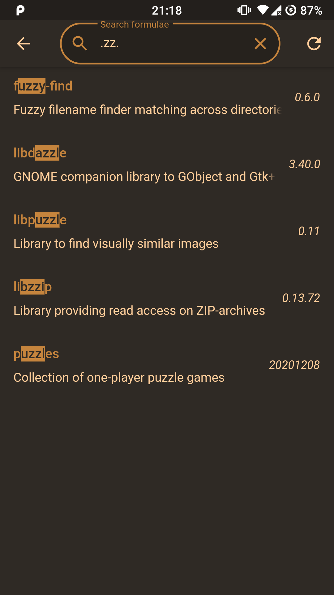

<h1>Brewery</h1>

A cross-platform frontend to [Homebrew formulae API](https://formulae.brew.sh).

## Features

- [x] Works on many platforms
- [x] Supports formulae and casks
- [ ] Supports analytics
- [x] Regexp filtering of formulae and casks list
- [x] Filter results highlighting

... and more!

## Screenshots

## Platforms

Currently the following platforms are supported:
- Web
- Android
- iOS
- Linux

## Credits

Thanks to <a href="https://brew.sh" title="brew">Homebrew contributors</a> for making the Homebrew icon (BSD 2-Clause License), providing the API and maintaining the project
